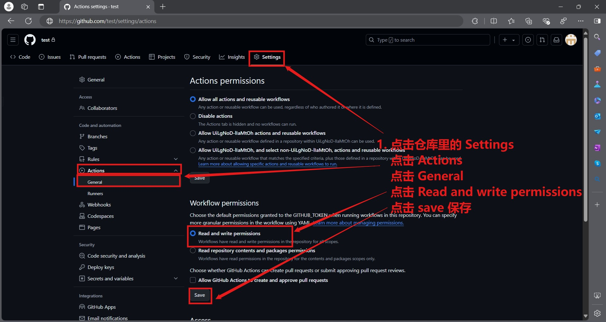
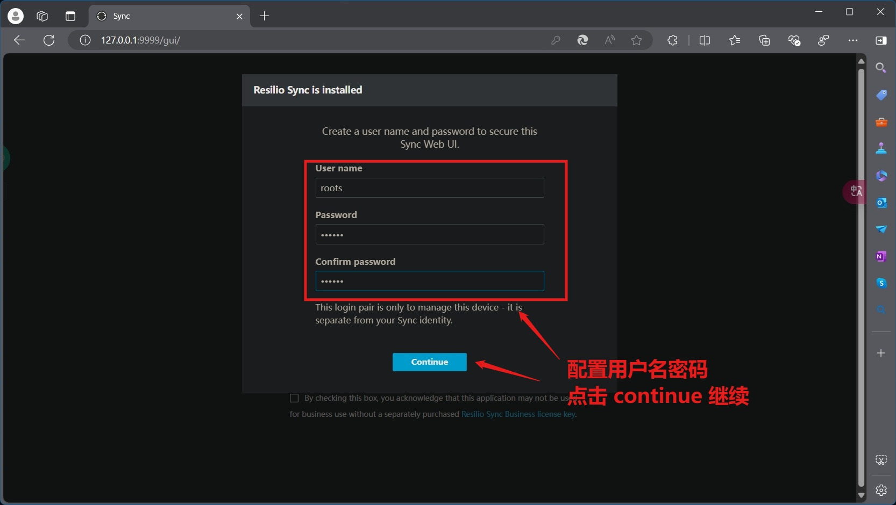
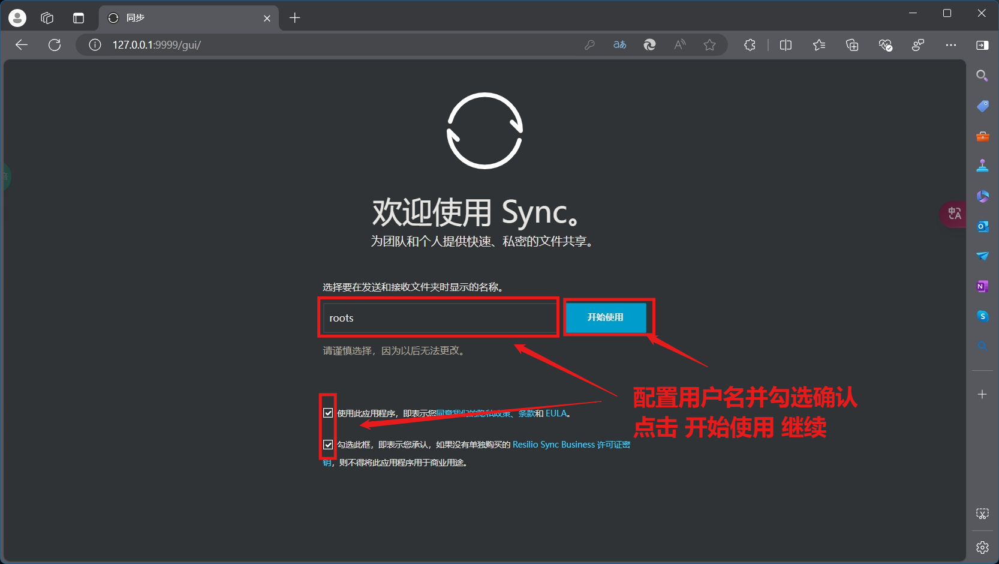
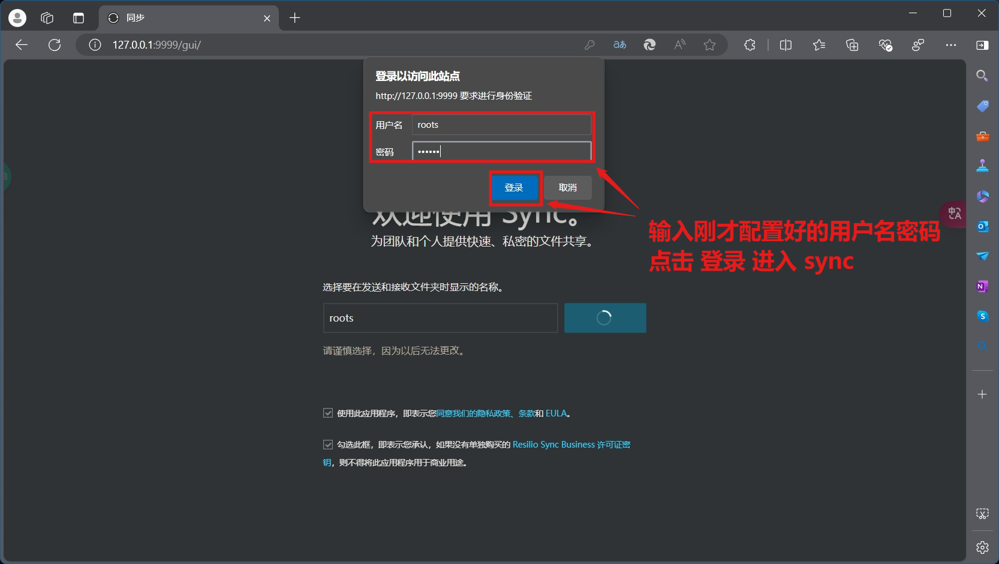
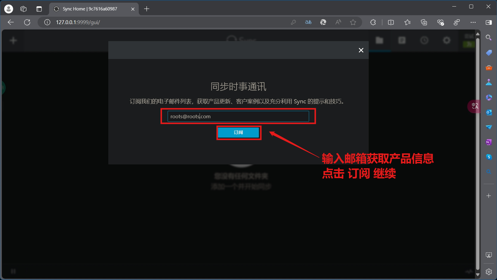
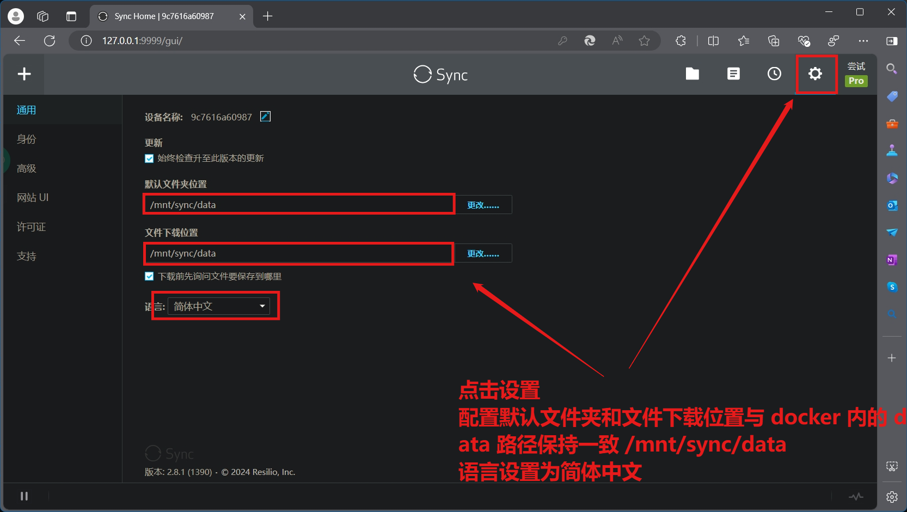
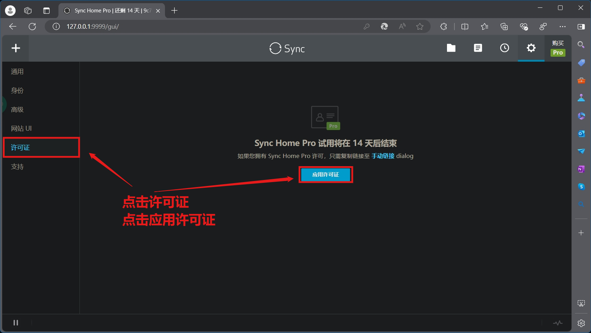
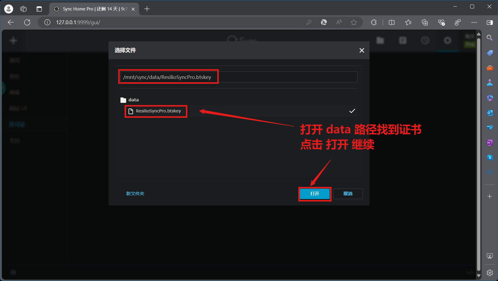
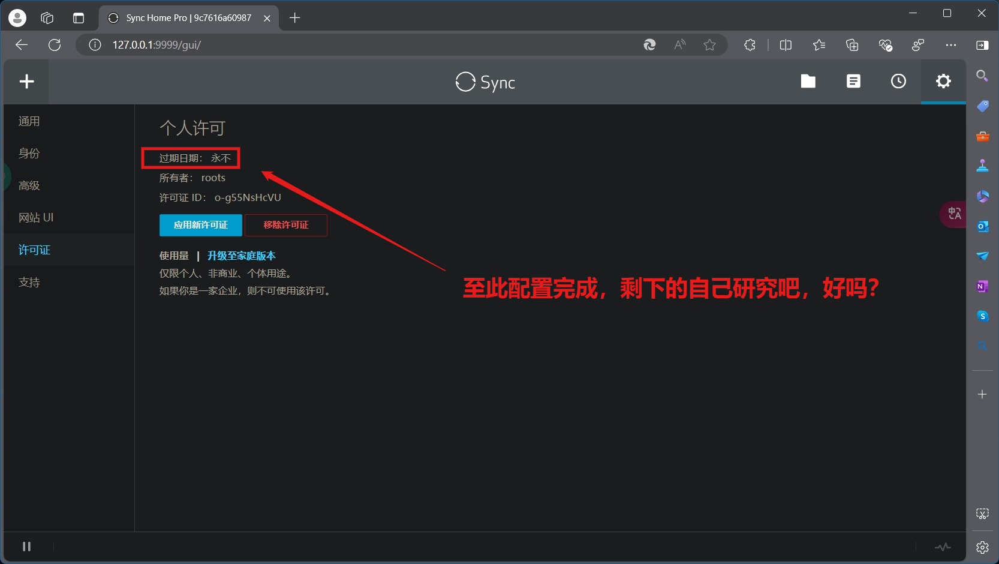

# docker-arch-resilio-sync
构建特殊的 Ubuntu 镜像运行容器，获取最终配置节点文件，主要用于学习提升技术。

    
<a href="https://star-history.com/#20241204/docker-arch-resilio-sync&Date">
  <picture>
    <source media="(prefers-color-scheme: dark)" srcset="https://api.star-history.com/svg?repos=20241204/docker-arch-resilio-sync&type=Date&theme=dark" />
    <source media="(prefers-color-scheme: light)" srcset="https://api.star-history.com/svg?repos=20241204/docker-arch-resilio-sync&type=Date" />
    
  </picture>
</a>

## ghcr.io
镜像仓库链接：[https://github.com/20241204/docker-arch-resilio-sync/pkgs/container/docker-arch-resilio-sync](https://github.com/20241204/docker-arch-resilio-sync/pkgs/container/docker-arch-resilio-sync)  

## 描述
1.为了实现 actions workflow 自动化 docker 构建运行，需要添加 `GITHUB_TOKEN` 环境变量，这个是访问 GitHub API 的令牌，可以在 GitHub 主页，点击个人头像，Settings -> Developer settings -> Personal access tokens -> Tokens (classic) -> Generate new token -> Generate new token (classic) ，设置名字为 GITHUB_TOKEN 接着要配置 环境变量有效时间，勾选环境变量作用域 repo write:packages workflow 和 admin:repo_hook 即可，最后点击Generate token，如图所示

  

2.赋予 actions[bot] 读/写仓库权限，在仓库中点击 Settings -> Actions -> General -> Workflow Permissions -> Read and write permissions -> save，如图所示

3.转到 Actions  

    -> Clean Git Large Files 并且启动 workflow，实现自动化清理 .git 目录大文件记录  
    -> Docker Image Build and Deploy Images to GHCR CI 并且启动 workflow，实现自动化构建镜像并推送云端  
    -> Remove Old Workflow Runs 并且启动 workflow，实现自动化清理 workflow 并保留最后三个    

4.目录结构：

    .                                            # 这个是根目录
    ├── .github                                  # 这个是github虚拟机项目
    │   └── workflows                            # 这个是工作流文件夹
    │       ├── actions.yml                      # 这个是docker构建编译流文件
    │       ├── clean-git-large-files.yml        # 这个是清理 .git 大文件流文件
    │       └── remove-old-workflow.yml          # 这个是移除缓存流文件
    ├── docker-compose-amd64.yml                 # 这个是 docker-compose amd64 配置文件  
    ├── docker-compose-arm64.yml                 # 这个是 docker-compose arm64 配置文件  
    ├── Dockerfile                               # 这个是 docker 构建文件  
    └── package                                  # 这个是证书、脚本、配置文件所在目录    
        ├── run_sync                             # 这个是启动 rslsync 的脚本  
        ├── sync.conf                            # 这个是 rslsync 默认配置文件，也可以按照需求配置                  
        └── ResilioSyncPro.btskey                # 这个是证书  

## 依赖
    amd64 设备
    docker 程序
    docker-compose python程序
    我目前能想到的必要程序就这些吧

## 构建命令
    # clone 项目
    git clone https://github.com/20241204/docker-arch-resilio-sync
    # 进入目录
    cd docker-arch-resilio-sync
    # 无缓存构建
    docker-compose build --no-cache

## 构建完成后 后台启动
    docker-compose up -d

## 浏览器访问
    http://127.0.0.1:9999/gui/

## 配置 data 目录
    # 配置用户名密码，路径和语言，并应用证书
    # 设置默认文件夹和下载文件夹
      和 docker 容器目录内的 sync data 数据共享同步目录相同
      /mnt/sync/data
    # 剩下自己研究好吗？
   
   
   
   
   
   
   
   

## 感谢
resilio sync 官网：https://www.resilio.com/  
Resilio, Inc. ：https://github.com/bt-sync  

## 参考
Install Docker Engine：https://docs.docker.com/engine/install/  
Install Docker Compose：https://docs.docker.com/compose/install/  
sync-docker：https://github.com/bt-sync/sync-docker  
Overview of Docker Compose：https://docs.docker.com/compose/  
